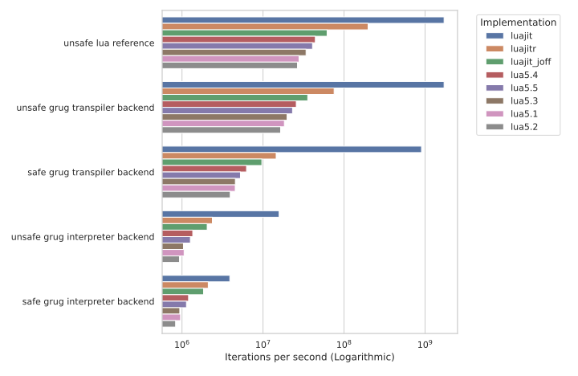
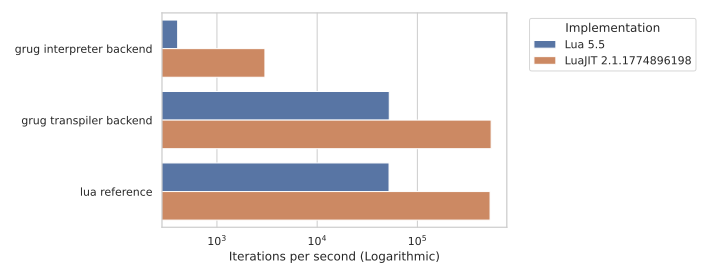

# grug for Lua

A Lua implementation of [grug](https://github.com/grug-lang/grug).

## Why grug?

* **Safer, simpler language design:** Static typing and a restricted feature set reduce runtime errors and eliminate common engine pitfalls.
* **Hot reloading:** Update mod code and resource files at runtime without restarting the host.
* **Stable, predictable performance:** Avoids JIT edge cases (e.g. LuaJIT [NYI](https://github.com/tarantool/tarantool/wiki/LuaJIT-Not-Yet-Implemented) issues), and CI ensures all benchmarks run as fast in LuaJIT as their equivalent `reference.lua` implementations.
* **Portable and future-proof:** Lossless JSON AST enables cross-language transpilation, tooling, and long-term compatibility ("immortal mods"), with all execution behavior defined by host-provided APIs.

## Example

Run the minimal example:

```sh
cd examples/minimal && lua example.lua
````

Here is `example.lua`:

```lua
-- grug.lua is two directories up
package.path = package.path .. ";../../?.lua"

local grug = require("grug")

-- You can pass your own list_dir(path) and is_dir(path) instead:
-- grug.init({ fs = { list_dir = list_dir, is_dir = is_dir, } })
local state = grug.init({
	grug_files = { "animals/labrador-Dog.grug" },
})

state:register("print_string", function(state, string)
	print(string)
end)

local file = state.mods["animals"]["labrador-Dog.grug"]
local dog1 = file:create_entity()
local dog2 = file:create_entity()

while true do
	state:update()
	dog1:on_bark("woof")
	dog2:on_bark("arf")
end
```

Here is `animals/labrador-Dog.grug`:

```py
on_bark(sound: string) {
    print_string(sound)

    # Print "arf" a second time
    if sound == "arf" {
        print_string(sound)
    }
}
```

It repeatedly prints this, and you can play with the grug file without having to restart the program:

```
woof
arf
arf
```

## Dependencies

* Lua 5.1 or newer ([LuaJIT](https://luajit.org/index.html) recommended)

## Running tests

Clone [grug-tests](https://github.com/grug-lang/grug-tests) next to this repository and build it, then run:

```sh
python amalgamate.py && luajit tests.lua
```

This will:

* regenerate `grug.lua`
* run the full test suite

## Benchmarks

### Benchmark: [benchmarks/minimal/](https://github.com/grug-lang/grug-for-lua/tree/main/benchmarks/minimal)



### Benchmark: [benchmarks/fibonacci/](https://github.com/grug-lang/grug-for-lua/tree/main/benchmarks/fibonacci)



### Installing dependencies

```sh
pip install matplotlib seaborn
```

### Running all benchmarks

Customize this command to pass your own executable names and JSON output paths:
```sh
python run_benchmarks.py \
  --impl lua lua5.5.json \
  --impl luajit luajit.json
```

### Investigating slow benchmarks

The CI throws an error if it finds any [LuaJIT NYI](https://github.com/tarantool/tarantool/wiki/LuaJIT-Not-Yet-Implemented) in the trace, as NYIs aren't compiled:
```
[TRACE --- grug.lua:2715 -- NYI: bytecode FNEW   at grug.lua:2724]
```

See Cloudflare's blog post [LuaJIT Hacking: Getting next() out of the NYI list](https://blog.cloudflare.com/luajit-hacking-getting-next-out-of-the-nyi-list/) for more information.

If a specific benchmark is unexpectedly slow even with LuaJIT, `cd` into its directory and run `luajit -jv benchmark.lua` to print its trace.

You can also add `-jv` to the executables passed to `run_benchmarks.py`:
```sh
python run_benchmarks.py --impl "luajit -jv" luajit.json 2>&1 | tee luajit.log
```

### Generating graphs for all results

```sh
python visualize_benchmarks.py
```

## CI behavior

The CI pipeline automatically:

* Regenerates `grug.lua` via `amalgamate.py`
* Ensures no uncommitted changes exist (`git diff --exit-code`)
* Runs the full test suite against `grug-tests`
* Executes the minimal Lua example as an integration test

## Contributing

If you modify Python or Lua source files, note that CI enforces:

* formatting (Black, StyLua)
* type checking (Pyright)
* static analysis (luacheck)
* up-to-date generated output

## Pre-commit hooks (recommended)

### Install pre-commit

```bash
pip install pre-commit
pre-commit install
```

### Install luacheck

You can install it using the [LuaRocks](https://github.com/luarocks/luarocks) package manager:
```bash
luarocks install luacheck
```

### Run manually

```bash
pre-commit run --all-files
```
